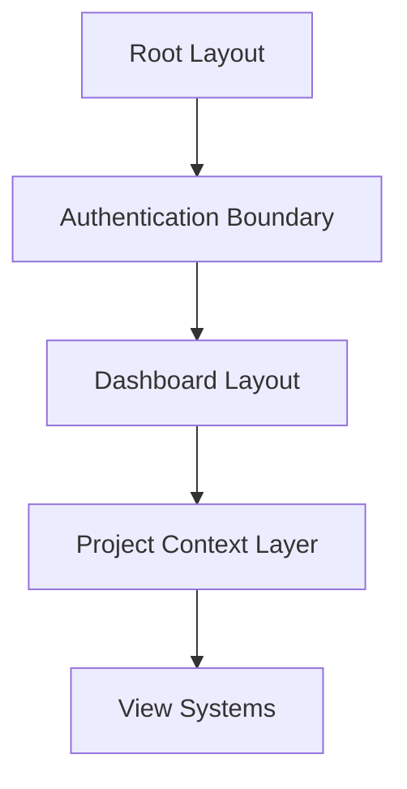
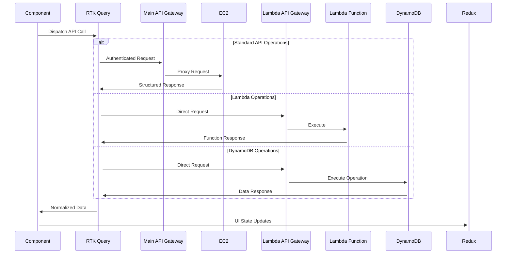

# MagooOS Client Architecture Guide

## 1. Architecture Overview
### Next.js App Router Structure


### Comprehensive File Structure
```text
client/
├── next.config.mjs
├── tailwind.config.ts
├── .env.local
├── src/
│   ├── app/
│   │   ├── layout.tsx
│   │   ├── page.tsx
│   │   ├── authProvider.tsx
│   │   ├── dashboardWrapper.tsx
│   │   ├── redux.tsx
│   │   ├── home/
│   │   │   └── page.tsx
│   │   ├── priority/
│   │   │   ├── backlog/
│   │   │   │   └── page.tsx
│   │   │   ├── high/
│   │   │   │   └── page.tsx
│   │   │   ├── medium/
│   │   │   │   └── page.tsx
│   │   │   ├── low/
│   │   │   │   └── page.tsx
│   │   │   ├── urgent/
│   │   │   │   └── page.tsx
│   │   │   └── reusablePriorityPage/
│   │   │       └── index.tsx
│   │   ├── projects/
│   │   │   ├── [id]/
│   │   │   │   └── page.tsx
│   │   │   ├── BoardView/
│   │   │   │   └── index.tsx
│   │   │   ├── ListView/
│   │   │   │   └── index.tsx
│   │   │   ├── TableView/
│   │   │   │   └── index.tsx
│   │   │   ├── TimelineView/
│   │   │   │   └── index.tsx
│   │   │   └── ModalNewProject/
│   │   │       └── index.tsx
│   │   ├── search/
│   │   │   └── page.tsx
│   │   ├── settings/
│   │   │   └── page.tsx
│   │   ├── teams/
│   │   │   └── page.tsx
│   │   ├── timeline/
│   │   │   └── page.tsx
│   │   └── users/
│   │       └── page.tsx
│   ├── components/
│   │   ├── Header/
│   │   │   └── index.tsx
│   │   ├── LocationTable/
│   │   │   └── index.tsx
│   │   ├── Modal/
│   │   │   └── index.tsx
│   │   ├── ModalNewTask/
│   │   │   └── index.tsx
│   │   ├── Navbar/
│   │   │   └── index.tsx
│   │   ├── ProjectCard/
│   │   │   └── index.tsx
│   │   ├── Sidebar/
│   │   │   └── index.tsx
│   │   ├── TaskCard/
│   │   │   └── index.tsx
│   │   └── UserCard/
│   │       └── index.tsx
│   └── state/
│       ├── api.ts
│       ├── lambdaApi.ts
│       └── index.ts
```

1. Core Configuration Files:
- `next.config.mjs`: Configures Next.js settings, API endpoints, and AWS Cognito integration. Handles environment variables and build optimizations.
- `tailwind.config.ts`: Defines custom theme settings, colors, and responsive breakpoints for the application's styling.
- `.env.local`: Stores sensitive configuration like API URLs and authentication settings.

2. App Structure (`src/app/`):
- `layout.tsx`: Root layout component that wraps all pages. Implements the Inter font and provides the base HTML structure.
- `page.tsx`: Main landing/login page where users first enter the application.
- `authProvider.tsx`: Manages AWS Cognito authentication flow, user sessions, and protected routes.
- `dashboardWrapper.tsx`: Implements the main application layout with responsive sidebar, navbar, and handles theme switching.
- `redux.tsx`: Sets up the Redux store, combines reducers, and configures middleware for state management.

3. Priority Management (`priority/`):
- `backlog/page.tsx`: Displays lower priority tasks that aren't currently active but need to be tracked.
- `high/page.tsx`: Shows critical tasks that need attention soon but aren't urgent.
- `medium/page.tsx`: Displays standard priority tasks for normal workflow.
- `low/page.tsx`: Lists tasks that can be addressed when resources are available.
- `urgent/page.tsx`: Highlights immediate action items requiring quick response.
- `reusablePriorityPage/index.tsx`: Shared component that implements common priority view functionality.

4. Project Views:
- `projects/[id]/page.tsx`: Dynamic project page showing details, tasks, and team members for a specific project.
- `projects/BoardView/index.tsx`: Kanban board implementation with drag-and-drop task management across status columns.
- `projects/ListView/index.tsx`: Linear list view of tasks with sorting and filtering capabilities.
- `projects/TableView/index.tsx`: Spreadsheet-style view with columns for task properties and inline editing.
- `projects/TimelineView/index.tsx`: Gantt chart style view showing task dependencies and project timeline.
- `projects/ModalNewProject/index.tsx`: Form modal for creating new projects with validation.

5. Core Components:
- `Header/index.tsx`: Page header with breadcrumbs, actions, and contextual navigation.
- `LocationTable/index.tsx`: Interactive table displaying locations from DynamoDB with sorting capabilities.
- `Modal/index.tsx`: Reusable modal dialog with backdrop and animation support.
- `ModalNewTask/index.tsx`: Task creation form with rich text editor and file attachments.
- `Navbar/index.tsx`: Top navigation bar with search, notifications, and user menu.
- `ProjectCard/index.tsx`: Card component showing project overview, progress, and quick actions.
- `Sidebar/index.tsx`: Collapsible navigation menu with project shortcuts and main app sections.
- `TaskCard/index.tsx`: Rich task card with priority indicators, assignees, and comments.
- `UserCard/index.tsx`: Displays user information with avatar, role, and team details.

6. State Management:
- `api.ts`: Defines all API endpoints using RTK Query, handles authentication, caching, and real-time updates.
  * Projects: CRUD operations for project management
  * Tasks: Creation, updates, status changes, assignments
  * Users: Profile management and permissions
  * Teams: Team creation and member management
  * Search: Global search across all entities
- `lambdaApi.ts`: Defines Lambda function endpoints and direct DynamoDB interactions.
  * Data processing: Report generation and analysis
  * Locations: DynamoDB integration for location data
- `index.ts`: Exports store configuration and typed hooks for state access.

7. Additional Features:
- `search/page.tsx`: Global search interface with filters and real-time results.
- `settings/page.tsx`: Displays user profile, team membership, and Cognito details. Shows real-time user data including:
  * Username and Cognito ID
  * Current team and team type (admin/regular)
  * User ID and system details
- `teams/page.tsx`: Enhanced team management with:
  * Create teams with optional admin privileges
  * Join existing teams with real-time status updates
  * View team type (admin/regular) and current membership
  * Improved UI with validation and error handling
- `timeline/page.tsx`: Organization-wide timeline showing all project milestones.
- `users/page.tsx`: User administration, role management, and team assignments.

### Core Feature Modules
- **Auth System**: Cognito integration with JWT validation
- **State Management**: Redux Toolkit with API slice pattern
- **View Systems**: Board/Table/Timeline view implementations
- **Data Flow**: RTK Query endpoints for API interactions
- **Direct DynamoDB**: API Gateway integration for location data

### State Management Flow


## 2. Key File Map
### Layout Hierarchy
| Layout File              | Responsibility                          | Key Features                      |
|--------------------------|-----------------------------------------|-----------------------------------|
| `layout.tsx`             | Root HTML structure                     | Metadata, global CSS              |
| `dashboardWrapper.tsx`   | Auth & State provider boundary          | Redux, Cognito session management |
| Project Layouts          | Context-specific UI scaffolding         | Dynamic route handling            |

### API Layer Structure
```text
state/
├── api.ts            # RTK Query endpoint definitions
├── lambdaApi.ts      # Lambda and DynamoDB endpoints
├── redux.tsx         # Store configuration
└── index.ts          # State exports
```

## 3. Core Systems
### Authentication Flow
```typescript
// dashboardWrapper.tsx
<StoreProvider>
  <AuthProvider>
    <DashboardLayout>{children}</DashboardLayout>
  </AuthProvider>
</StoreProvider>
```

### API Service Architecture

#### Main API Configuration
```typescript
// api.ts - Core RTK Query Configuration
export const api = createApi({
  baseQuery: fetchBaseQuery({
    baseUrl: process.env.NEXT_PUBLIC_API_BASE_URL,
    prepareHeaders: async (headers) => {
      const session = await fetchAuthSession();
      headers.set("Authorization", `Bearer ${session.tokens?.accessToken}`);
      return headers;
    }
  }),
  endpoints: (build) => ({
    // Team Management
    getTeams: build.query<Team[], void>({
      query: () => "teams",
      providesTags: ["Teams"]
    }),
    createTeam: build.mutation<Team, { teamName: string; isAdmin: boolean }>({
      query: (body) => ({
        url: "teams",
        method: "POST",
        body
      }),
      invalidatesTags: ["Teams"]
    }),
    joinTeam: build.mutation<void, { teamId: number; userId: number }>({
      query: ({ teamId, userId }) => ({
        url: `teams/${teamId}/join`,
        method: "POST",
        body: { userId }
      }),
      invalidatesTags: ["Teams", "Auth"]
    }),

    // User Management
    getAuthUser: build.query<{ userDetails: User }, void>({
      query: () => "users/me",
      providesTags: ["Auth"]
    }),
    // ... other endpoints
  })
});
```

#### Lambda API Configuration
```typescript
// lambdaApi.ts - Lambda and DynamoDB Integration
export const lambdaApi = createApi({
  reducerPath: "lambdaApi",
  baseQuery: fetchBaseQuery({
    baseUrl: process.env.NEXT_PUBLIC_LAMBDA_API_URL,
    prepareHeaders: async (headers) => {
      // Same auth as main API
      const session = await fetchAuthSession();
      const { accessToken } = session.tokens ?? {};
      if (accessToken) {
        headers.set("Authorization", `Bearer ${accessToken}`);
      }
      return headers;
    },
  }),
  endpoints: (builder) => ({
    // Data processing endpoint - direct Lambda access
    processData: builder.mutation<DataReportResponse, DataReportRequest>({
      query: (data) => ({
        url: "process-data",  // Matches Lambda API Gateway resource path
        method: "POST",
        body: data,
      }),
    }),
    
    // Locations endpoint - direct DynamoDB integration
    getLocations: builder.query<LocationsResponse, void>({
      query: () => ({
        url: "locations",
        method: "POST", // API Gateway transforms to DynamoDB operation
        body: {}, // Empty body, mapping template provides TableName
      }),
      keepUnusedDataFor: 86400, // 24 hours cache
    }),
  }),
});

// Export hooks for use in components
export const { 
  useProcessDataMutation,
  useGetLocationsQuery 
} = lambdaApi;
```

## 4. Component Catalog
### Core Interactive Elements
| Component       | Key Features                          | State Dependencies         |
|-----------------|---------------------------------------|----------------------------|
| Navbar          | Global navigation, dark mode toggle   | isDarkMode (Redux)         |
| Sidebar         | Collapsible project navigation        | isSidebarCollapsed (Redux) |
| TaskCard        | Drag-and-drop, status updates         | useUpdateTaskStatus        |
| BoardView       | DnD context provider                  | useGetProjectsTasks        |
| LocationTable   | Location selection, sorting           | useGetLocationsQuery       |

### Data Visualization Components
```typescript
// BoardView implementation
<DndContext>
  {tasks.map(task => (
    <SortableTask key={task.id} task={task} />
  ))}
</DndContext>

// LocationTable implementation
<TableContainer>
  <Table>
    <TableHead>
      <TableRow>
        <TableCell>
          <TableSortLabel
            active={orderBy === 'name'}
            direction={orderBy === 'name' ? order : 'asc'}
            onClick={() => handleRequestSort('name')}
          >
            Location Name
          </TableSortLabel>
        </TableCell>
        <TableCell>ID</TableCell>
      </TableRow>
    </TableHead>
    <TableBody>
      {sortedLocations.map((location) => (
        <TableRow 
          key={location.id}
          onClick={() => onLocationSelect(location)}
        >
          <TableCell>{location.name}</TableCell>
          <TableCell>{location.id}</TableCell>
        </TableRow>
      ))}
    </TableBody>
  </Table>
</TableContainer>
```

## 5. Performance Patterns
### Data Fetching Strategy
```typescript
// RTK Query automatic caching
useGetProjectsQuery(); // Cache: 5min
useGetTasksQuery({ projectId }); // Cache: 2min
useGetLocationsQuery(); // Cache: 24hrs (infrequently changing data)
```

### Optimization Techniques
1. **Memoization**: React.memo for complex components
2. **Virtualization**: react-window for long lists
3. **Bundle Splitting**: Dynamic imports for view systems
4. **Selective Fetching**: Direct service integrations for specific data needs

## 6. Deployment & Environment
### Runtime Configuration
```javascript
// next.config.mjs
export default {
  publicRuntimeConfig: {
    apiEndpoint: process.env.NEXT_PUBLIC_API_BASE_URL,
    lambdaEndpoint: process.env.NEXT_PUBLIC_LAMBDA_API_URL,
    cognitoPoolId: process.env.NEXT_PUBLIC_COGNITO_POOL_ID
  },
  productionBrowserSourceMaps: true
};
```

### AWS Integration
```text
Frontend Flow:
Amplify (CI/CD) → CloudFront → S3

API Flow:
Client → API Gateway (/prod/*) → EC2 → RDS

Lambda Flow:
Client → Lambda API Gateway → Lambda/DynamoDB

Authentication:
Cognito → Lambda → API Gateway
```

### Build Optimization
```text
Next.js Features:
- Automatic code splitting
- SSG for public pages
- ISR for project views
- Compression: Brotli + Gzip
