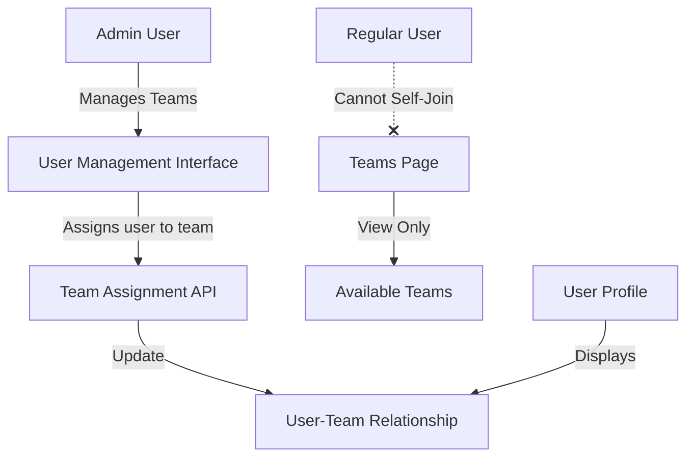
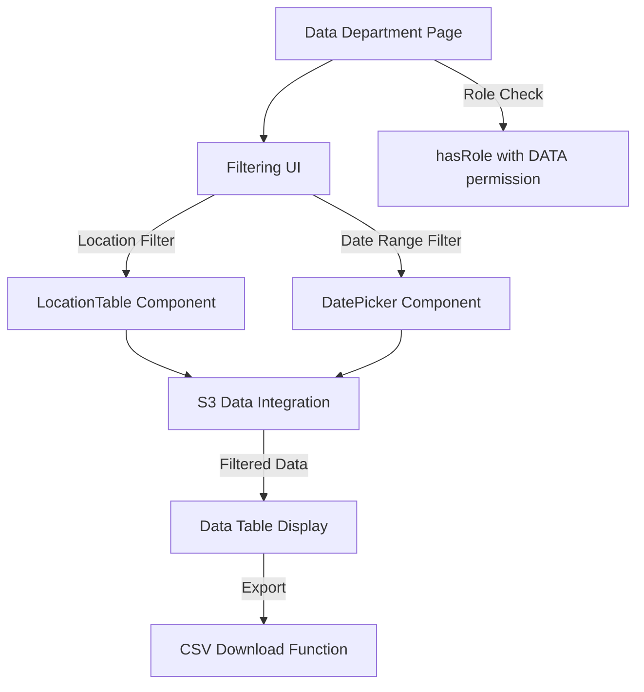

# Feature Implementation Plan

## 1. Team Assignment Security Improvements

### Current System
Currently, users can join any team through self-service, which creates a security risk:
- Users can join teams they shouldn't have access to
- No approval process for team membership
- Potential for unauthorized access to department-specific features

### Proposed Architecture

### Implementation Strategy

1. **Backend Modifications**
   - Modify the existing `/teams/:teamId/join` endpoint to restrict access to admin users only
   - Add admin role verification middleware to the join endpoint
   - Create additional endpoint variants for API Gateway compatibility (following our established pattern)
   - Add detailed logging for troubleshooting API Gateway mapping issues

2. **Frontend Enhancements**
   - Add team assignment interface to the Users page for admins
   - Display current team assignment in user profiles
   - Implement team selection dropdown with available teams
   - Remove join functionality from Teams page for non-admin users
   - Convert Teams page to view-only display for regular users
   - Maintain team creation capability for admin users only

3. **State Management Updates**
   - Update API client to reflect the admin-only team assignment logic
   - Implement proper cache invalidation for user and team data
   - Ensure state consistency across the application

4. **Security Considerations**
   - Verify admin role before allowing team assignment
   - Log all team assignment actions for audit purposes
   - Implement proper validation to prevent unauthorized team assignments
   - Ensure consistent permission checks across all team management functionality

## 2. Data Department Page Enhancement

### Architecture Overview

### Implementation Strategy

1. **S3 Integration Approach**
   - Configure API Gateway for S3 bucket access without AWS SDK
   - Create endpoints for listing and retrieving files from the S3 bucket
   - Implement mapping templates for S3 operations
   - Set up proper authentication and authorization for S3 access
   - Integrate with frontend through the Lambda API gateway

2. **CSV Processing System**
   - Design client-side CSV processing workflow
   - Implement filtering functionality by location and date range
   - Create data transformation utilities for different data formats
   - Optimize for performance with large CSV files
   - Support various CSV formats and layouts

3. **Filtering Interface**
   - Design a user-friendly filtering UI with:
     - Location selector with available locations
     - Date range picker for temporal filtering
     - Apply filters button to trigger data refresh
     - Reset button to clear all filters
   - Ensure the filtering interface is responsive and accessible
   - Implement validation for filter inputs
   - Save filter preferences for user sessions

4. **Data Table Component**
   - Create a flexible data table for displaying filtered CSV data
   - Implement sortable columns for better data exploration
   - Add pagination for large datasets
   - Include data visualization options where appropriate
   - Provide a download button to export filtered data as CSV
   - Support customizable column visibility
   - Optimize rendering for performance with large datasets

5. **Permission Control**
   - Restrict access to DATA role members only
   - Implement role verification at both frontend and backend
   - Handle unauthorized access gracefully with informative messages
   - Track data access patterns for security audit purposes

## 3. Red Flag Report Enhancement

### Integration with Filtering System

The goal is to create a consistent filtering experience across the Data Department and Red Flag Report pages.

1. **Component Reusability**
   - Design reusable filtering components that can be shared between pages
   - Maintain consistent UI patterns and interaction models
   - Share utilities for date/location filtering
   - Ensure consistent styling and behavior

2. **Implementation Approach**
   - Extract filtering logic into reusable components
   - Apply these components to both Data and Red Flag pages
   - Ensure that filters work seamlessly with both data sources
   - Implement specialized filtering options for Red Flag reports as needed
   - Maintain consistent visual language and interaction patterns

3. **Data Integration**
   - Connect the filtering system to the appropriate data sources
   - Ensure filtering logic works correctly for both report types
   - Optimize query performance for filtered results
   - Implement appropriate caching strategies
   - Provide clear loading states during data retrieval

4. **User Experience**
   - Design a consistent and intuitive user interface for filtering
   - Provide clear visual feedback for active filters
   - Include the ability to save and load filter presets
   - Ensure accessibility across all filtering components
   - Support responsive layouts for all screen sizes

## 4. Final UI Refinement

### Huey Aesthetics
- Apply consistent branding throughout the application
- Update color scheme to match Huey guidelines
- Improve visual hierarchy for better usability
- Implement consistent spacing and typography
- Ensure all UI elements follow the design system

### Hide Non-Essentials
- Implement role-based UI rendering to show only relevant features
- Create feature flags for controlling in-development features
- Simplify navigation based on user roles
- Remove or hide legacy features that are no longer needed
- Focus the UI on core workflows for each user type

### Implementation Strategy
1. Create shared styling constants for consistent branding
2. Implement conditional rendering based on user roles
3. Add a feature flag system for gradual feature rollout
4. Perform usability testing with stakeholders
5. Gather feedback and make incremental improvements

## Implementation Phases

### Phase 1: Team Assignment Security (1-2 weeks)
1. Restrict team join functionality to admin users only
2. Implement admin team assignment on user page
3. Add API Gateway compatible endpoint variants
4. Test role-based permissions
5. Deploy and monitor

**Success Criteria:**
- Only admins can assign users to teams
- Teams page shows view-only information for regular users
- User profiles display current team assignment
- All team assignment actions are properly logged
- No security vulnerabilities in team assignment process

### Phase 2: Data Department Enhancement (2-3 weeks)
1. Create filtering UI components
2. Implement S3 data integration
3. Develop CSV processing system
4. Build data table with export function
5. Test with real data sets
6. Deploy and gather initial feedback

**Success Criteria:**
- Data department page accessible only to users with DATA role
- Filtering by location and date range works correctly
- CSV data displayed accurately in the data table
- Export functionality produces correct CSV files
- Performance is acceptable with large datasets
- S3 integration works without AWS SDK dependencies

### Phase 3: Red Flag Report Improvement (1-2 weeks)
1. Apply filtering system to red flag report
2. Ensure consistency with data department
3. Test filtering functionality
4. Optimize performance
5. Deploy and monitor usage

**Success Criteria:**
- Filtering interface consistent with Data Department page
- Report data filtered correctly by location and date
- UI components maintain consistent behavior
- Performance meets expectations
- User feedback is positive

### Phase 4: UI Refinement (1-2 weeks)
1. Apply Huey aesthetics
2. Hide non-essential elements
3. Implement feature flags
4. Conduct user testing
5. Prepare for limited user release

**Success Criteria:**
- UI follows Huey design guidelines
- Interface is simplified and focused on essential features
- Feature flags control access to new functionality
- Positive feedback from initial test users
- System ready for broader release