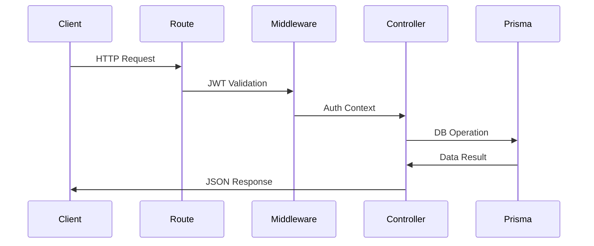

# MagooOS Server Architecture Guide

## Server Structure Overview
```text
server/
├── prisma/
│   ├── schema.prisma              # Database schema and relationships
│   ├── migrations/                # Database migration history
│   │   └── YYYYMMDDHHMMSS_name/   # Timestamped migrations
│   └── seedData/                  # Sample data for development
│       ├── user.json
│       ├── team.json
│       ├── project.json
│       ├── task.json
│       ├── comment.json
│       └── attachment.json
├── src/
│   ├── index.ts                   # Main server entry point
│   ├── controllers/               # Business logic handlers
│   │   ├── projectController.ts   # Project management logic
│   │   ├── taskController.ts      # Task operations and assignments
│   │   ├── teamController.ts      # Team management operations
│   │   ├── userController.ts      # User operations and Cognito sync
│   │   └── searchController.ts    # Global search functionality
│   └── routes/                    # API endpoint definitions
│       ├── projectRoutes.ts       # Project-related endpoints
│       ├── taskRoutes.ts          # Task management endpoints
│       ├── teamRoutes.ts          # Team operations endpoints
│       ├── userRoutes.ts          # User management endpoints
│       └── searchRoutes.ts        # Search functionality endpoints
└── ecosystem.config.js            # PM2 production configuration
```

## Detailed Component Breakdown

### 1. Core Server Components

#### Main Server (`src/index.ts`)
- Express.js server configuration
- Middleware setup (CORS, Helmet, Morgan)
- Route registration and API endpoint mounting
- Environment configuration and server initialization
- Security headers and request parsing setup

#### Controllers
1. **Project Controller** (`controllers/projectController.ts`)
   - Project CRUD operations
   - Team assignment management
   - Project timeline handling

2. **Task Controller** (`controllers/taskController.ts`)
   - Task creation and updates
   - Status management
   - Assignment handling
   - Priority and timeline tracking

3. **Team Controller** (`controllers/teamController.ts`)
   - Team creation and management
   - Member assignments
   - Role management (Product Owner, Project Manager)

4. **User Controller** (`controllers/userController.ts`)
   - User profile management
   - AWS Cognito synchronization
   - Authentication handling
   - Profile picture management

5. **Search Controller** (`controllers/searchController.ts`)
   - Global search implementation
   - Cross-entity search functionality
   - Results aggregation

#### Routes
1. **Project Routes** (`routes/projectRoutes.ts`)
   - GET /projects - List all projects
   - POST /projects - Create new project
   - GET /projects/:id - Project details
   - PUT /projects/:id - Update project
   - DELETE /projects/:id - Remove project

2. **Task Routes** (`routes/taskRoutes.ts`)
   - GET /tasks - List tasks (with filters)
   - POST /tasks - Create task
   - PATCH /tasks/:id/status - Update status
   - GET /tasks/user/:userId - User's tasks

3. **Team Routes** (`routes/teamRoutes.ts`)
   - Team CRUD operations
   - Member management endpoints
   - Team assignment handling

4. **User Routes** (`routes/userRoutes.ts`)
   - User profile operations
   - Authentication endpoints
   - Profile updates

5. **Search Routes** (`routes/searchRoutes.ts`)
   - GET /search - Global search endpoint
   - Query parameter handling
   - Results filtering

### 2. Data Layer (Prisma)

#### Schema (`prisma/schema.prisma`)
Core Models:
1. **User**
   - Basic profile information
   - Cognito integration
   - Team associations
   - Task relationships (author/assignee)

2. **Team**
   - Team structure
   - Leadership roles
   - Project associations

3. **Project**
   - Project metadata
   - Timeline information
   - Team assignments

4. **Task**
   - Core task information
   - Status and priority
   - Assignments and relationships
   - Comments and attachments

5. **Supporting Models**
   - TaskAssignment: Many-to-many user-task relationships
   - Attachment: File management
   - Comment: Task discussions
   - ProjectTeam: Project-team associations

### 3. Data Model Details
```prisma
// Entity Relationships:
// User ↔ Task ↔ Project ↔ Team

// Actual Task Model (Lines 59-79):
model Task {
  id             Int       @id @default(autoincrement())
  title          String
  description    String?
  status         String?   // [Backlog, InProgress, Completed]
  priority       String?   // [Low, Medium, High, Urgent]
  tags           String?
  startDate      DateTime?
  dueDate        DateTime?
  points         Int?
  project        Project   @relation(fields: [projectId])
  author         User      @relation("TaskAuthor")
  assignee       User?     @relation("TaskAssignee")
}
```

### 4. Controller-Route Flow


## Modification Guide

### Adding Features (Example: Notifications)

1. **Extend Prisma Schema**
```prisma
// Add to schema.prisma
model Notification {
  id        Int      @id @default(autoincrement())
  message   String
  userId    Int
  createdAt DateTime @default(now())
  user      User     @relation(fields: [userId])
}
```

2. **Create Controller**
```typescript
// src/controllers/notificationController.ts
export const getNotifications = async (userId: number) => {
  return prisma.notification.findMany({
    where: { userId },
    orderBy: { createdAt: 'desc' }
  });
};
```

3. **Implement Route**
```typescript
// src/routes/notificationRoutes.ts
router.get('/notifications', 
  authMiddleware,
  notificationController.getNotifications
);
```

4. **Generate Migration**
```bash
npx prisma migrate dev --name add_notifications
npx prisma generate
```

## AWS Integration (Original + Enhanced)

### EC2 Configuration
```javascript
// ecosystem.config.js
module.exports = {
  apps: [{
    name: "magoo-api",
    script: "./dist/index.js",
    env_production: {
      NODE_ENV: "production",
      DATABASE_URL: process.env.RDS_CONNECTION_STRING,
      COGNITO_POOL_ID: process.env.AWS_COGNITO_POOL_ID
    }
  }]
}
```

### Security Implementation
```typescript
// Auth Middleware (src/middleware/auth.ts)
const verifyToken = (token: string) => {
  return jwt.verify(token, process.env.COGNITO_POOL_ID!);
};
```

## Maintenance & Operations

| Task                      | Command                          | Frequency       |
|---------------------------|----------------------------------|-----------------|
| Database Backups          | pg_dump -h RDS_ENDPOINT ...     | Daily           |
| Prisma Migrations         | npx prisma migrate deploy       | On schema change|
| PM2 Process Monitoring    | pm2 logs magoo-api --lines 100  | As needed       |

## Troubleshooting

1. **Database Connection Issues**
```bash
# Test connection:
psql $DATABASE_URL -c "SELECT 1"
```

2. **JWT Validation Failures**
```bash
# Decode token for inspection:
echo $TOKEN | jq -R 'split(".") | .[1] | @base64d | fromjson'
```

3. **Prisma Client Errors**
```bash
# Full clean rebuild:
rm -rf node_modules/.prisma
npm install
npx prisma generate
