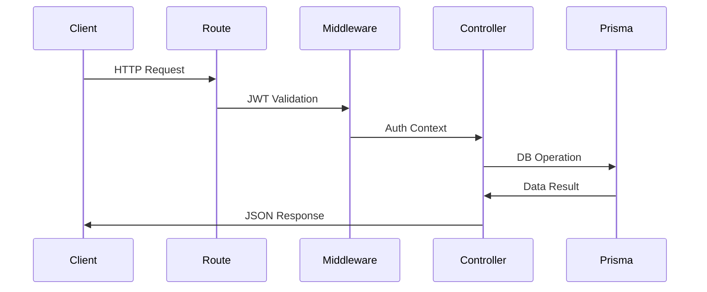

# MagooOS Server Architecture Guide

## Server Structure Overview
```text
server/
├── prisma/
│   ├── schema.prisma              # Database schema and relationships
│   ├── migrations/                # Database migration history
│   │   └── YYYYMMDDHHMMSS_name/   # Timestamped migrations
│   └── seedData/                  # Sample data for development
│       ├── user.json
│       ├── team.json
│       ├── project.json
│       ├── task.json
│       ├── comment.json
│       └── attachment.json
├── src/
│   ├── index.ts                   # Main server entry point
│   ├── controllers/               # Business logic handlers
│   │   ├── projectController.ts   # Project management logic
│   │   ├── taskController.ts      # Task operations and assignments
│   │   ├── teamController.ts      # Team management operations
│   │   ├── userController.ts      # User operations and Cognito sync
│   │   └── searchController.ts    # Global search functionality
│   └── routes/                    # API endpoint definitions
│       ├── projectRoutes.ts       # Project-related endpoints
│       ├── taskRoutes.ts          # Task management endpoints
│       ├── teamRoutes.ts          # Team operations endpoints
│       ├── userRoutes.ts          # User management endpoints
│       └── searchRoutes.ts        # Search functionality endpoints
└── ecosystem.config.js            # PM2 production configuration
```

## Detailed Component Breakdown

### 1. Core Server Components

#### Main Server (`src/index.ts`)
- Express.js server configuration
- Middleware setup (CORS, Helmet, Morgan)
- Route registration and API endpoint mounting
- Environment configuration and server initialization
- Security headers and request parsing setup

#### Controllers
1. **Project Controller** (`controllers/projectController.ts`)
   - Project CRUD operations
   - Team assignment management
   - Project timeline handling

2. **Task Controller** (`controllers/taskController.ts`)
   - Task creation and updates
   - Status management
   - Assignment handling
   - Priority and timeline tracking

3. **Team Controller** (`controllers/teamController.ts`)
   - Team creation and management
   - Member assignments
   - Role-based access control
     - ADMIN role: Full system access (equivalent to legacy isAdmin=true)
     - DATA role: Access to data department
     - REPORTING role: Access to reporting department
   - Role assignment endpoints:
     - Get available roles
     - Add/remove roles from teams
   - Permission checking utility functions

4. **User Controller** (`controllers/userController.ts`)
   - User profile management
   - AWS Cognito synchronization
   - Authentication handling
   - Profile picture management

5. **Search Controller** (`controllers/searchController.ts`)
   - Global search implementation
   - Cross-entity search functionality
   - Results aggregation

#### Routes
1. **Project Routes** (`routes/projectRoutes.ts`)
   - GET /projects - List all projects
   - POST /projects - Create new project
   - GET /projects/:id - Project details
   - PUT /projects/:id - Update project
   - DELETE /projects/:id - Remove project

2. **Task Routes** (`routes/taskRoutes.ts`)
   - GET /tasks - List tasks (with filters)
   - POST /tasks - Create task
   - PATCH /tasks/:id/status - Update status
   - GET /tasks/user/:userId - User's tasks

3. **Team Routes** (`routes/teamRoutes.ts`)
   - Team CRUD operations
   - Member management endpoints
   - Team assignment handling
   - Role management endpoints:
     - GET /teams/roles - List all available roles
     - POST /teams/:teamId/roles - Add a role to a team
     - DELETE /teams/:teamId/roles/:roleId - Remove a role from a team

4. **User Routes** (`routes/userRoutes.ts`)
   - User profile operations
   - Authentication endpoints
   - Profile updates

5. **Search Routes** (`routes/searchRoutes.ts`)
   - GET /search - Global search endpoint
   - Query parameter handling
   - Results filtering

### 2. Data Layer (Prisma)

#### Schema (`prisma/schema.prisma`)
Core Models:
1. **User**
   - Basic profile information
   - Cognito integration
   - Team associations
   - Task relationships (author/assignee)

2. **Role**
   - Role name (e.g., ADMIN, DATA, REPORTING)
   - Optional description
   - Relationship to teams through TeamRole

3. **TeamRole**
   - Many-to-many relationship between Team and Role
   - Unique constraint on teamId+roleId combinations
   - Cascade deletion with parent entities

4. **Team**
   - Team structure
   - Leadership roles
   - Project associations
   - Role assignments via TeamRole
   - Legacy isAdmin field (maintained for backward compatibility)

5. **Project**
   - Project metadata
   - Timeline information
   - Team assignments

6. **Task**
   - Core task information
   - Status and priority
   - Assignments and relationships
   - Comments and attachments

7. **Supporting Models**
   - TaskAssignment: Many-to-many user-task relationships
   - Attachment: File management
   - Comment: Task discussions
   - ProjectTeam: Project-team associations

### 3. Data Model Details
```prisma
// Entity Relationships:
// User ↔ Task ↔ Project ↔ Team

// Actual Task Model (Lines 59-79):
model Task {
  id             Int       @id @default(autoincrement())
  title          String
  description    String?
  status         String?   // [Backlog, InProgress, Completed]
  priority       String?   // [Low, Medium, High, Urgent]
  tags           String?
  startDate      DateTime?
  dueDate        DateTime?
  points         Int?
  project        Project   @relation(fields: [projectId])
  author         User      @relation("TaskAuthor")
  assignee       User?     @relation("TaskAssignee")
}
```

### 4. Controller-Route Flow


## Modification Guide

### Adding Features (Example: Role-Based Access Control)

1. **Implementing Permission Checks in Controllers**
```typescript
// src/controllers/departmentController.ts
export const getDataDepartmentData = async (req: Request, res: Response): Promise<void> => {
  try {
    // Get current user from JWT token
    const userId = req.user.userId;
    
    // Get user with team and roles
    const user = await prisma.user.findUnique({
      where: { userId },
      include: {
        team: {
          include: {
            teamRoles: {
              include: { role: true }
            }
          }
        }
      }
    });

    // Check if user's team has access to data department (DATA role or ADMIN role)
    const hasDataAccess = user?.team?.teamRoles.some(
      tr => tr.role.name === 'DATA' || tr.role.name === 'ADMIN'
    );
    
    if (!hasDataAccess) {
      return res.status(403).json({
        message: "Access denied: requires DATA or ADMIN role"
      });
    }
    
    // Proceed with data department logic for authorized users
    const departmentData = await prisma.dataRecord.findMany();
    return res.json(departmentData);
  } catch (error: any) {
    console.error("[GET /data] Error:", error);
    res.status(500).json({ message: "Error retrieving data department information" });
  }
};
```

2. **Using the hasRole Utility Function**
```typescript
// src/controllers/accessController.ts
import { hasRole } from "../controllers/teamController";

export const checkDepartmentAccess = async (req: Request, res: Response, next: NextFunction): Promise<void> => {
  try {
    const { department } = req.params;
    const user = await prisma.user.findUnique({
      where: { userId: req.user.userId },
      include: { team: true }
    });
    
    if (!user?.team) {
      return res.status(403).json({ message: "User must be in a team" });
    }
    
    // Map department to required role
    const requiredRole = department.toUpperCase();
    
    // Check if user's team has the required role
    const hasAccess = await hasRole(user.team.id, requiredRole) ||
                      await hasRole(user.team.id, 'ADMIN');
    
    if (!hasAccess) {
      return res.status(403).json({
        message: `Access denied: requires ${requiredRole} role`
      });
    }
    
    next();
  } catch (error: any) {
    console.error("[checkDepartmentAccess] Error:", error);
    res.status(500).json({ message: "Error checking access permissions" });
  }
};

// Usage in routes:
router.get('/departments/:department', checkDepartmentAccess, getDepartmentData);
```

3. **Creating New Roles and Assigning to Teams**
```typescript
// Migration or seed script
async function setupRoles() {
  // Create standard roles
  const roles = [
    { name: 'ADMIN', description: 'Full system access' },
    { name: 'DATA', description: 'Access to data department' },
    { name: 'REPORTING', description: 'Access to reporting department' }
  ];
  
  for (const role of roles) {
    await prisma.role.upsert({
      where: { name: role.name },
      update: { description: role.description },
      create: {
        name: role.name,
        description: role.description
      }
    });
  }
  
  // Grant roles to existing admin teams
  const adminTeams = await prisma.team.findMany({
    where: { isAdmin: true }
  });
  
  const adminRole = await prisma.role.findUnique({
    where: { name: 'ADMIN' }
  });
  
  if (adminRole) {
    for (const team of adminTeams) {
      await prisma.teamRole.upsert({
        where: {
          teamId_roleId: {
            teamId: team.id,
            roleId: adminRole.id
          }
        },
        update: {},
        create: {
          teamId: team.id,
          roleId: adminRole.id
        }
      });
    }
  }
}
```

4. **Generate Migration for Role Models**
```bash
npx prisma migrate dev --name add_role_based_access
npx prisma generate
```

## AWS Integration

### EC2 Configuration
```javascript
// ecosystem.config.js
module.exports = {
  apps: [{
    name: "magooos-backend",
    script: "npm",
    args: "start",
    env: {
      NODE_ENV: "production",
      PORT: 3000,
      DATABASE_URL: process.env.DATABASE_URL
    },
    error_file: "/home/ubuntu/.pm2/logs/magooos-backend-error.log",
    out_file: "/home/ubuntu/.pm2/logs/magooos-backend-out.log",
    time: true,
    watch: false,
    instances: 1,
    exec_mode: "fork",
    max_memory_restart: "500M",
    restart_delay: 4000,
    autorestart: true
  }]
}
```

### API Gateway Integration

#### API Gateway Role & Team Integration Best Practices

When working with complex data structures and relationships through API Gateway (like team roles), follow these best practices:

1. **Return Combined Data in Single Requests**
   - Instead of separate endpoints for related data (like teams and roles), return combined data in a single response
   - Example: `/teams` endpoint returns both teams and available roles in a single JSON object
   ```typescript
   // Return combined data structure
   res.json({
     teams: processedTeams,
     availableRoles: allRoles
   });
   ```

2. **Provide Multiple Path Options for Critical Resources**
   - Create multiple equivalent endpoints with different path structures to handle API Gateway mapping variations
   - Example for roles endpoint:
   ```typescript
   // Primary endpoint
   router.get("/roles", getRoles);
   
   // Alternative endpoints if primary isn't mapped correctly
   router.get("/api-roles", getRoles);
   router.get("/all-roles", getRoles);
   ```

3. **Use Explicit Anti-Caching Headers**
   - API Gateway may cache responses, causing stale data to be returned
   - Always add explicit anti-caching headers for dynamic data endpoints
   ```typescript
   // Set anti-caching headers for dynamic data
   res.setHeader('Content-Type', 'application/json');
   res.setHeader('Cache-Control', 'no-store, no-cache, must-revalidate, proxy-revalidate');
   res.setHeader('Pragma', 'no-cache');
   res.setHeader('Expires', '0');
   res.setHeader('Surrogate-Control', 'no-store');
   ```

4. **Add Debug Logging for Request Path Analysis**
   - Include debug logs to identify path mapping issues
   ```typescript
   router.get("/roles", (req, res) => {
     console.log("[GET /teams/roles] Called directly!");
     console.log("Path:", req.path);
     console.log("URL:", req.url);
     console.log("Original URL:", req.originalUrl);
     
     // Call the actual handler
     return getRoles(req, res);
   });
   ```

5. **Implement Client-Side Smart Data Extraction**
   - Design API clients to extract data from related endpoints when direct access fails
   ```typescript
   // Example: Extract roles from teams endpoint if roles endpoint fails
   getRoles: build.query<Role[], void>({
     queryFn: (_, { dispatch, getState }) => {
       // Try to get roles from the teams query cache first
       const teamsResult = (getState() as any).api.queries['getTeams(undefined)']?.data;
       
       if (teamsResult?.availableRoles) {
         // If we already have the data, return it immediately
         return { data: teamsResult.availableRoles };
       } else {
         // Otherwise, force a refresh of the teams data
         dispatch(api.endpoints.getTeams.initiate(undefined, {
           subscribe: false,
           forceRefetch: true
         }));
         
         // Return empty array with pending status
         return { data: [] };
       }
     },
     providesTags: ["Roles"],
   }),
   ```

#### Main API Gateway (Proxy Integration)
The main Express server is configured to handle API Gateway's `/prod` stage prefix:

```typescript
// src/index.ts
app.use(cors({
  origin: process.env.NODE_ENV === 'production'
    ? 'https://main.d2qm7hnxk5z1hy.amplifyapp.com'
    : 'http://localhost:3000',
  methods: ['GET', 'POST', 'PUT', 'DELETE', 'OPTIONS'],
  allowedHeaders: ['Content-Type', 'Authorization']
}));
```

#### Direct Lambda API Gateway
A separate API Gateway is used for direct Lambda integrations and DynamoDB access:

- **Gateway ID**: sutpql04fb.execute-api.us-east-2.amazonaws.com/prod
- **Integration Types**:
  * Direct Lambda (non-proxy) for compute functions
  * AWS Service Integration for DynamoDB operations
- **Resources**:
  * `/process-data` - Data extraction and report generation (Lambda)
  * `/locations` - Location data retrieval (DynamoDB)
- **Frontend Integration**: Accessed via `lambdaApi.ts` in the client

This separation provides several advantages:
1. Improved performance by eliminating proxy overhead
2. Direct service integration for simple data operations
3. Reduced cold start latency for data retrieval

#### DynamoDB Integration
The DynamoDB integration uses API Gateway's AWS Service Integration feature:

```
// API Gateway: /locations POST Method Request
Integration Request:
{
  "TableName": "Location-u3tk7jwqujcqfedzbv7hksrt4a-NONE"
}

// API Gateway: /locations POST Method Response
Integration Response:
{
  "locations": [
    #foreach($item in $inputRoot.Items)
    {
      "id": "$item.id.S",
      "name": "$item.name.S",
      "__typename": "Location"
    }#if($foreach.hasNext),#end
    #end
  ]
}
```

This pattern provides several advantages:
1. No Lambda cold starts for simple data operations
2. No SDK dependencies in frontend or backend code
3. Simplified maintenance with declarative mapping templates
4. Consistent authentication using the same Cognito flow

### Error Handling Middleware
```typescript
// Error handling middleware
app.use((err: any, req: Request, res: Response, next: any) => {
  console.error('Error:', err.stack);
  res.status(500).json({ 
    error: 'Internal Server Error',
    message: process.env.NODE_ENV === 'development' ? err.message : undefined
  });
});

// Global error handling
process.on('unhandledRejection', (reason, promise) => {
  console.error('Unhandled Rejection at:', promise, 'reason:', reason);
});
```

### Enhanced Controller Implementation
Example of robust controller implementation with validation and error handling:

```typescript
// src/controllers/teamController.ts
export const createTeam = async (req: Request, res: Response): Promise<void> => {
  const { teamName, isAdmin } = req.body;
  console.log("[POST /teams] Creating team:", { teamName, isAdmin });

  // Input validation
  if (!teamName || typeof teamName !== 'string' || teamName.trim().length === 0) {
    console.error("[POST /teams] Invalid team name");
    res.status(400).json({ message: "Team name is required" });
    return;
  }

  try {
    // Check for duplicates
    const existingTeam = await prisma.team.findFirst({
      where: { teamName: teamName.trim() }
    });

    if (existingTeam) {
      console.error("[POST /teams] Team name already exists:", teamName);
      res.status(409).json({ message: "Team name already exists" });
      return;
    }

    const team = await prisma.team.create({
      data: {
        teamName: teamName.trim(),
        isAdmin: Boolean(isAdmin)
      }
    });

    console.log("[POST /teams] Team created:", team);
    res.status(201).json(team);
  } catch (error: any) {
    console.error("[POST /teams] Error:", error);
    res.status(500).json({ 
      message: "Error creating team",
      error: process.env.NODE_ENV === 'development' ? error.message : undefined
    });
  }
};
```

## Maintenance & Operations

| Task                      | Command                                | Frequency       |
|---------------------------|----------------------------------------|-----------------|
| Database Backups          | pg_dump -h RDS_ENDPOINT ...           | Daily           |
| Prisma Migrations         | npx prisma migrate deploy             | On schema change|
| PM2 Process Monitoring    | pm2 logs magooos-backend --lines 100  | As needed       |
| Server Status Check       | pm2 list                              | Daily           |
| Error Log Review          | pm2 logs magooos-backend --err        | Daily           |
| NGINX Config Test         | sudo nginx -t                         | After changes   |
| API Gateway Test          | curl -v API_GATEWAY_URL/prod/teams    | After deploy    |
| DynamoDB Table Status     | aws dynamodb describe-table           | Weekly          |

## Troubleshooting

1. **Database Connection Issues**
```bash
# Test connection:
psql $DATABASE_URL -c "SELECT 1"
```

2. **JWT Validation Failures**
```bash
# Decode token for inspection:
echo $TOKEN | jq -R 'split(".") | .[1] | @base64d | fromjson'
```

3. **Prisma Client Errors**
```bash
# Full clean rebuild:
rm -rf node_modules/.prisma
npm install
npx prisma generate
```

4. **API Gateway Integration Issues**
```bash
# Test API Gateway endpoints:
curl -v -H "Authorization: Bearer $TOKEN" https://sutpql04fb.execute-api.us-east-2.amazonaws.com/prod/locations
```

5. **DynamoDB Access Issues**
```bash
# Check IAM permissions for the API Gateway role
aws iam list-attached-role-policies --role-name ApiGatewayDynamoDBRole


### Production Deployment Steps

To deploy a backend change like one to teams or user to production, follow these steps:

1. Connect to the EC2 instance using EC2 Instance Connect
   ```bash
   # Use EC2 Instance Connect to SSH into the production server
   # Instance IP: 3.15.240.21
   
   # Switch to root user
   sudo su -
   ```

2. Update the codebase from the repository
   ```bash
   # Navigate to the repository directory (in root home directory)
   cd magooos-site
   
   # Pull the latest changes from the master branch
   git pull origin master
   
   # Navigate to the server directory and install dependencies
   cd server
   npm install
   ```

3. Run the Prisma migration
   ```bash
   # Apply the migration to the production database
   npx prisma migrate deploy
   # Generate the Prisma client
   npx prisma generate
   ```

4. Initialize the roles and migrate existing admin teams
   ```bash
   # The seed script is already configured in package.json
   # Run the seed script to create roles and migrate admin teams
   npm run seed
   ```

5. Restart the server
   ```bash
   # Restart the PM2 processes
   pm2 restart all
   ```

6. Verify the deployment
   ```bash
   # Check the server logs for any errors
   pm2 logs
   
   # Test the new roles endpoint
   curl -v https://puvzjk01yl.execute-api.us-east-2.amazonaws.com/prod/teams/roles \
     -H "Authorization: Bearer YOUR_JWT_TOKEN"
   ```